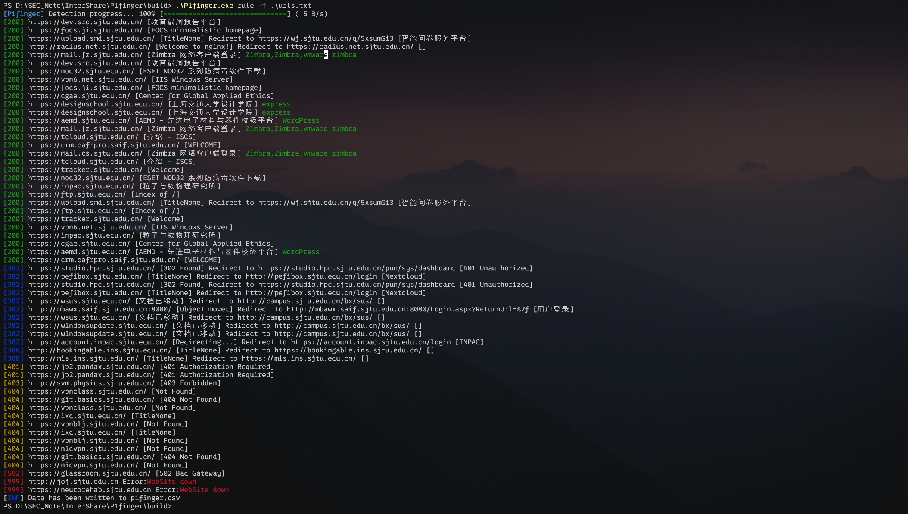

<h3 align="center">P1finger 一款红队行动下的重点资产指纹识别工具</h3>


# 功能特色

* P1finger 支持两种指纹识别模式：

  1. 基于P1finger本地规则库的Web指纹识别

  2. 基于FoFa空间测绘系统的Web指纹识别
* 双模式切换，红队模式识别重点资产、全量模式指纹结果更丰富
* Yaml文件模块化的指纹库，可用和维护方便
* 支持`csv`表格和`Json`格式导出，便于数据的二次处理
* 支持 http / socks代理使用

P1finger 指纹库：[P001water/P1finger-Fingerprints: P1finger - 指纹库和技术文档](https://github.com/P001water/P1finger-Fingerprints)

## Version

当前最新版本 `v0.1.3` （2025/7/12更新）[更新日志参见](https://github.com/P001water/P1finger/blob/master/更新日志.md)

---

## 首次运行配置

P1finger在命令行下首次运行生成 `p1fingerConf.yaml` 配置文件，在配置文件中填上 `email` 和 `key` 即可。

执行命令`P1finger rule`，生成的默认配置文件内容如下

```yaml
RuleMode: redteam //基于Rule模式识别时，使用的指纹库模式，使用全量指纹时修改为 "full"
FofaCredentials:
    Email: P001water@163.com
    ApiKey: xxxx

```

## 开始使用

```
Usage:

  P1finger [command]


Available Commands:

  finger       Operations on the P1finger fingerprint database
  fofa         Fingerprint Detect based on the Fofa cyberspace mapping engine.
  help         Help about any command
  rule         Fingerprint Detect based on the P1finger local fingerprint database
  upgrade      self upgrade
  version      Print the P1finger Version


Flags:

      --debug           http debug info, eg:[-debug]
  -h, --help            help for P1finger
  -o, --output string   output file name: [-o p1finger.csv] / [-o p1finger.json] (default "p1finger.csv")
  -p, --proxy string    proxy eg: [--proxy socks5://127.0.0.1]
```


## 使用示例

* 基于本地规则库模式使用

使用 `rule` 命令，指定参数

```
P1finger rule -u [target]
P1finger rule -f [target file] // -f 指定url文件

[-rate 500 可控制协程数量，默认值为500]
```



* 基于fofa的采集模式使用

使用`fofa`命令切换到Fofa模式，

```
P1finger fofa -u [target]
P1finger fofa -f [target file]
```


* 输出到`csv`表格和`Json`格式文件

 设置`-o`参数可自定义输出文件名，支持`json`和`csv表格`输出，默认输出为csv文件

```
P1finger fofa -f [target file] -o file.csv // file.csv可自定义文件名
```

* 代理模式使用

socks5 代理

```
P1finger.exe rule -f urls.txt --proxy socks5://127.0.0.1:8911
```

http 代理

```
P1finger.exe rule -f urls.txt --proxy http://127.0.0.1:8910
```


## 指纹库规则和如何贡献指纹

详情参考：[指纹库规范 - 安全漫道.team Wiki](https://securapath.github.io/SecuraPathWiki/P1finger/fingersRepo/)

# 致谢

感谢社区已有的指纹库和整合指纹库做出努力的作者们，P1finger的指纹库在这些巨人的肩膀上建立

* [0x727/FingerprintHub](https://github.com/0x727/FingerprintHub)
* [chainreactors/spray](https://github.com/chainreactors/spray)

